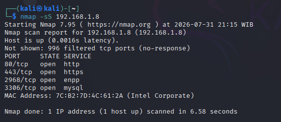
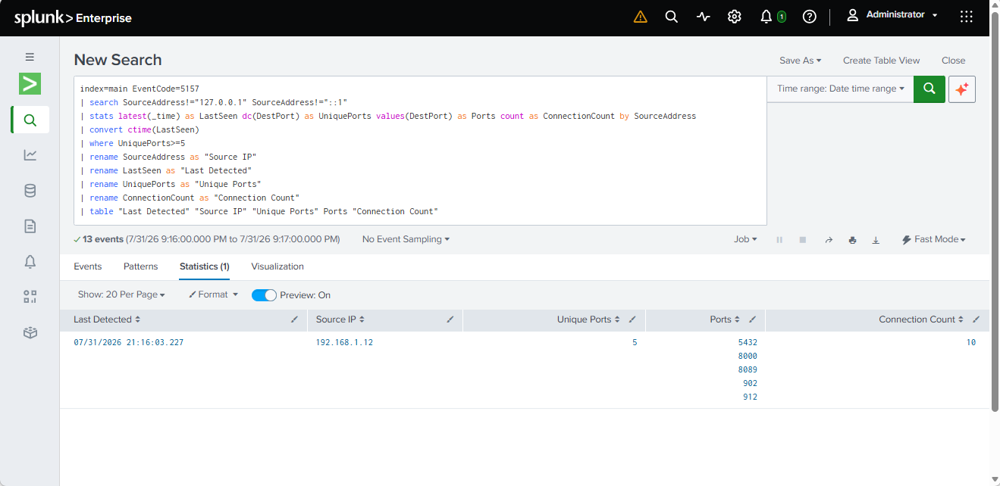
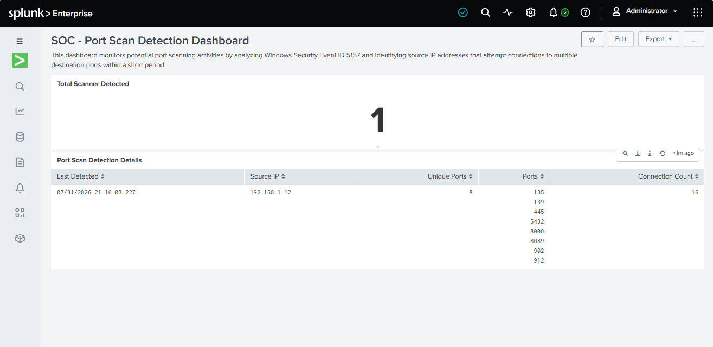
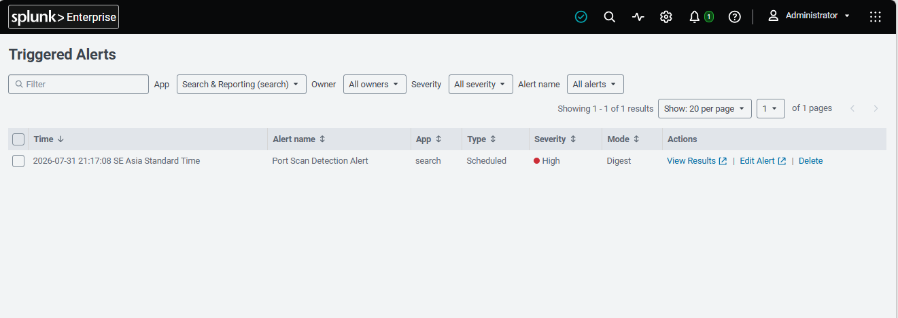
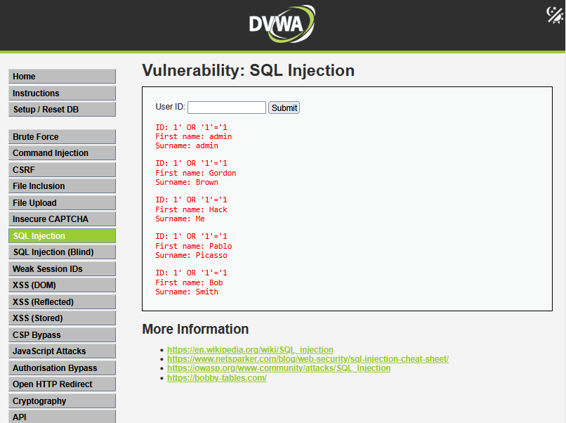
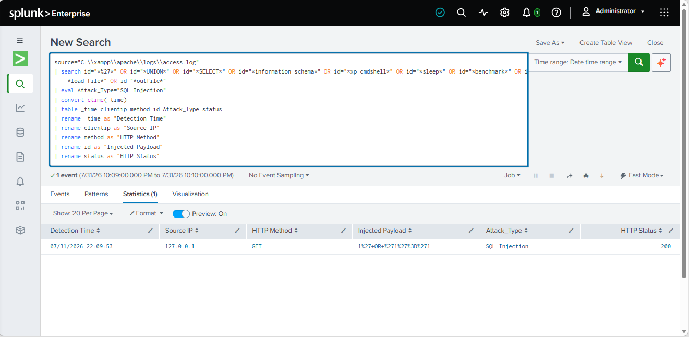
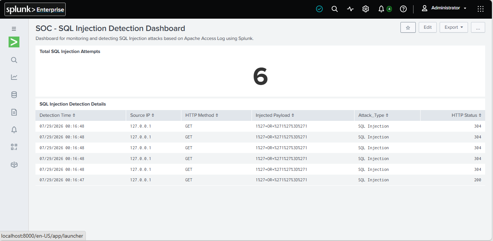
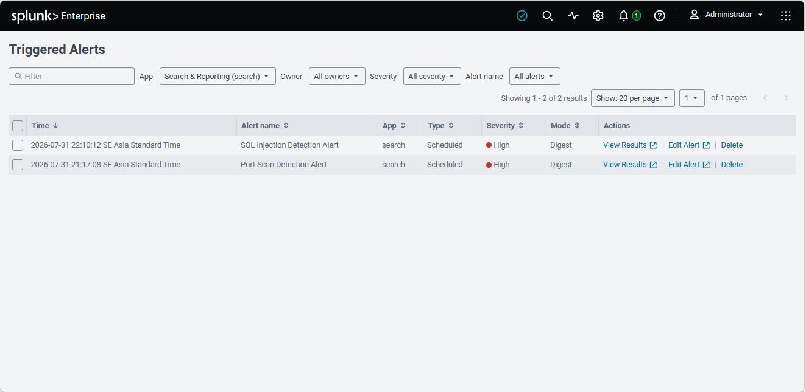

# 🛡️ SOC Threat Detection & Incident Response using Splunk Enterprise

## 📌 Overview

This project demonstrates an end-to-end Security Operations Center (SOC) implementation using **Splunk Enterprise** as a Security Information and Event Management (SIEM) platform.

The project simulates two common cyber attacks and demonstrates how security logs are collected, analyzed, detected, and handled through a structured Incident Response workflow.

This project was developed as part of the **Certified SOC Analyst (CSA) Final Project**.

---

# 🎯 Objectives

- Collect security logs from Windows and Apache Web Server
- Build a SIEM environment using Splunk Enterprise
- Detect Port Scan attacks
- Detect SQL Injection attacks
- Generate automated security alerts
- Perform Incident Response based on NIST Incident Handling lifecycle

---

# 🏗️ Lab Architecture

```
Attacker
      │
      ▼
Windows 10 + Apache (DVWA)
      │
      ▼
Splunk Universal Forwarder
      │
      ▼
Splunk Enterprise
      │
      ├── Dashboard
      ├── Detection Rules
      └── Triggered Alerts
```

---

# 🛠️ Technologies

| Technology | Purpose |
|------------|---------|
| Splunk Enterprise | SIEM Platform |
| Splunk Universal Forwarder | Log Collection |
| Windows Security Log | Endpoint Log Source |
| Apache Access Log | Web Server Log Source |
| XAMPP | Apache Web Server |
| DVWA | Vulnerable Web Application |
| Nmap | Port Scanning Simulation |
| Kali Linux | Attack Machine |

---

# 🔍 Use Case 1 – Port Scan Detection

### Attack

- Tool : Nmap
- Target : Windows 10
- Log Source : Windows Security Log
- Event ID : 5157

### Detection Logic

The SPL rule identifies a source IP attempting to connect to multiple destination ports within a short period.

### Output

- Source IP
- Destination Ports
- Connection Count
- Triggered Alert

---

# 💉 Use Case 2 – SQL Injection Detection

### Attack

Target application:

- Damn Vulnerable Web Application (DVWA)

Payload:

```sql
' OR '1'='1
```

### Detection Logic

Splunk analyzes Apache Access Log and searches for SQL Injection signatures such as:

- UNION
- SELECT
- OR
- information_schema
- xp_cmdshell
- sleep
- benchmark

### Output

- Source IP
- HTTP Method
- Injected Payload
- HTTP Status
- Triggered Alert

---

# 🚨 Incident Response Workflow

The incident response process follows the NIST Incident Handling lifecycle:

1. Detection
2. Containment
3. Eradication
4. Recovery
5. Lessons Learned

Both attack simulations successfully generated alerts and were handled through the defined Incident Response workflow.

---

# 📸 Project Screenshots

## 🔍 Use Case 1 – Port Scan Detection

### 1. Attack Simulation
Port scanning was simulated using **Nmap** against the Windows target to generate Windows Security Log events.



---

### 2. Detection Result
Splunk Enterprise analyzed Windows Security Log (Event ID 5157) and identified multiple connection attempts from the same source IP.



---

### 3. Dashboard Monitoring
Splunk dashboard provides visualization of port scan activities for monitoring and investigation.



---

### 4. Triggered Alert
An automated alert was generated after the detection rule identified a potential port scanning activity.



---

# 💉 Use Case 2 – SQL Injection Detection

### 1. Attack Simulation
SQL Injection was simulated on the **Damn Vulnerable Web Application (DVWA)** using a malicious payload.



---

### 2. Detection Result
Splunk Enterprise analyzed Apache Access Log and detected SQL Injection patterns based on predefined SPL rules.



---

### 3. Dashboard Monitoring
The dashboard visualizes SQL Injection events, making it easier for SOC analysts to monitor web application attacks.



---

### 4. Triggered Alert
Splunk automatically generated an alert after detecting SQL Injection activity from the Apache Access Log.



---

# 📂 Repository Structure

```
docs/
screenshots/
splunk/
architecture/
README.md
```

---

# 📖 Key Learning Outcomes

Throughout this project I gained hands-on experience in:

- Security Log Analysis
- SIEM Deployment
- Splunk Search Processing Language (SPL)
- Threat Detection
- Dashboard Development
- Alert Configuration
- Incident Response Documentation

---

# 📚 References

- EC-Council Certified SOC Analyst (CSA)
- Splunk Enterprise Documentation
- NIST SP 800-61 Revision 2
- MITRE ATT&CK Framework

---

# 👨‍💻 Author

**Muhammad Yoane Yatalathov**

Certified SOC Analyst (CSA)

Bachelor of Computer Science

Aspiring SOC Analyst

---
