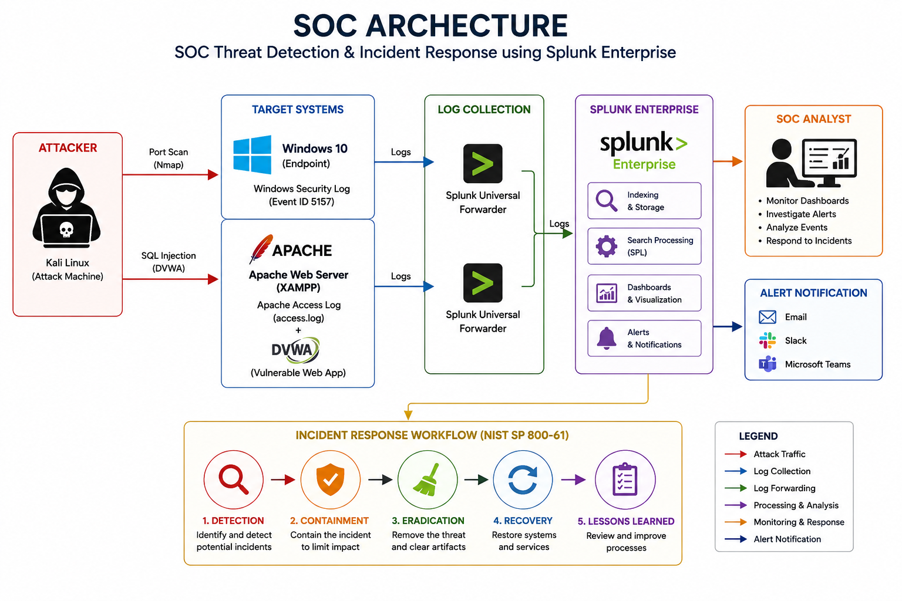

# 🛡️ SOC Threat Detection & Incident Response using Splunk Enterprise

## 📌 Overview

This project demonstrates an end-to-end **Security Operations Center (SOC)** implementation using **Splunk Enterprise** as a **Security Information and Event Management (SIEM)** platform.

The implementation covers the complete SOC workflow, including **log collection, threat detection, dashboard monitoring, alert generation, and incident response** through two hands-on attack simulations:

- 🔍 Port Scan Detection
- 💉 SQL Injection Detection

This project was developed as part of the **EC-Council Certified SOC Analyst (CSA) Final Project**.

---

# 📑 Table of Contents

- Overview
- Objectives
- Lab Architecture
- Technologies
- Use Case 1 – Port Scan Detection
- Use Case 2 – SQL Injection Detection
- Incident Response Workflow
- MITRE ATT&CK Mapping
- NIST Incident Response Mapping
- Project Screenshots
- Repository Structure
- Documentation
- Key Learning Outcomes
- Future Improvements
- References
- Author

---

# 🎯 Objectives

- Collect security logs from Windows and Apache Web Server
- Build a SIEM environment using Splunk Enterprise
- Detect Port Scan attacks
- Detect SQL Injection attacks
- Generate automated security alerts
- Perform Incident Response following the NIST Incident Handling lifecycle

---

# 🏗️ Lab Architecture

> The architecture diagram is available in the **architecture** folder.



---

# 🛠️ Technologies

| Technology | Purpose |
|------------|---------|
| Splunk Enterprise | SIEM Platform |
| Splunk Universal Forwarder | Log Collection |
| Windows Security Log | Endpoint Log Source |
| Apache Access Log | Web Server Log Source |
| XAMPP | Apache Web Server |
| DVWA | Vulnerable Web Application |
| Nmap | Port Scanning Simulation |
| Kali Linux | Attack Machine |

---

# 🔍 Use Case 1 – Port Scan Detection

### Attack

- Tool: Nmap
- Target: Windows 10
- Log Source: Windows Security Log
- Event ID: 5157

### Detection Logic

Splunk Enterprise detects a source IP communicating with multiple destination ports within a short period using Windows Security Log.

### Output

- Source IP
- Destination Ports
- Connection Count
- Dashboard Visualization
- Triggered Alert

---

# 💉 Use Case 2 – SQL Injection Detection

### Attack

Target Application:

- Damn Vulnerable Web Application (DVWA)

Payload:

```sql
' OR '1'='1
```

### Detection Logic

Splunk Enterprise analyzes Apache Access Log and detects SQL Injection signatures including:

- UNION
- SELECT
- OR
- information_schema
- xp_cmdshell
- sleep
- benchmark
- load_file
- outfile

### Output

- Source IP
- HTTP Method
- Injected Payload
- HTTP Status
- Dashboard Visualization
- Triggered Alert

---

# 🚨 Incident Response Workflow

The project follows the **NIST SP 800-61 Incident Handling lifecycle**.

1. Detection
2. Containment
3. Eradication
4. Recovery
5. Lessons Learned

Both attack simulations successfully generated alerts and were handled through a simulated Incident Response process.

---

# 🛡️ MITRE ATT&CK Mapping

| Use Case | Tactic | Technique |
|----------|--------|-----------|
| Port Scan | Reconnaissance | Active Scanning (T1595) |
| SQL Injection | Initial Access | Exploit Public-Facing Application (T1190) |

---

# 📋 NIST Incident Response Mapping

| Phase | Implementation |
|--------|----------------|
| Detection | Splunk Detection Rule & Alert |
| Containment | Source IP Verification |
| Eradication | Rule Review & Log Analysis |
| Recovery | System Validation & Continuous Monitoring |
| Lessons Learned | Documentation & Rule Improvement |

---

# 📸 Project Screenshots

## 🔍 Use Case 1 – Port Scan Detection

### 1. Attack Simulation

Port scanning was simulated using **Nmap** against the Windows target.


---

### 2. Detection Result

Splunk Enterprise analyzed Windows Security Log (Event ID 5157).


---

### 3. Dashboard Monitoring

Dashboard visualization for monitoring Port Scan activities.


---

### 4. Triggered Alert

Automatically generated alert after rule detection.


---

## 💉 Use Case 2 – SQL Injection Detection

### 1. Attack Simulation

SQL Injection simulated on DVWA.


---

### 2. Detection Result

Splunk Enterprise analyzed Apache Access Log.


---

### 3. Dashboard Monitoring

Dashboard visualization for SQL Injection events.


---

### 4. Triggered Alert

Automatically generated SQL Injection alert.


---

# 📂 Repository Structure

```text
SOC-Threat-Detection-using-Splunk-Enterprise
│
├── architecture/
│   ├── README.md
│   ├── soc-architecture.png
│   └── incident-response-workflow.png
│
├── docs/
│   ├── README.md
│   ├── CSA_Final_Project_Report.pdf
│   └── CSA_Final_Project_Presentation.pptx
│
├── screenshots/
│   ├── 01-port-scan-nmap.png
│   ├── 02-port-scan-detection.png
│   ├── 03-port-scan-dashboard.png
│   ├── 04-port-scan-alert.png
│   ├── 05-sqli-dvwa.png
│   ├── 06-sqli-detection.png
│   ├── 07-sqli-dashboard.png
│   └── 08-sqli-alert.png
│
├── splunk/
│   ├── README.md
│   ├── port-scan-detection.spl
│   └── sql-injection-detection.spl
│
├── LICENSE
└── README.md
```

---

# 📄 Documentation

Additional documentation is available in the **docs** directory.

- 📘 CSA Final Project Report
- 📊 Presentation Slides

---

# 📖 Key Learning Outcomes

This project provided hands-on experience in:

- Security Log Analysis
- SIEM Deployment
- Splunk Search Processing Language (SPL)
- Threat Detection
- Dashboard Development
- Alert Configuration
- Incident Response Documentation
- Security Monitoring

---

# 🚀 Future Improvements

- Integrate Threat Intelligence feeds
- Implement SOAR automation
- Add Sysmon-based detections
- Expand dashboard visualization
- Develop additional detection use cases
- Integrate EDR telemetry

---

# 📚 References

- EC-Council Certified SOC Analyst (CSA)
- Splunk Enterprise Documentation
- NIST SP 800-61 Revision 2
- MITRE ATT&CK Framework

---

# 👨‍💻 Author

**Muhammad Yoane Yatalathov**

🎓 Bachelor of Computer Science (S.Kom)

🛡️ EC-Council Certified SOC Analyst (CSA)

💻 Cybersecurity Enthusiast | SOC Analyst | SIEM | Threat Detection

📍 Serang, Banten, Indonesia

🔗 LinkedIn: https://linkedin.com/in/yoane-yatalathov

📧 Email: muhyatalathov@gmail.com

---

⭐ If you find this project useful, feel free to give it a star.
