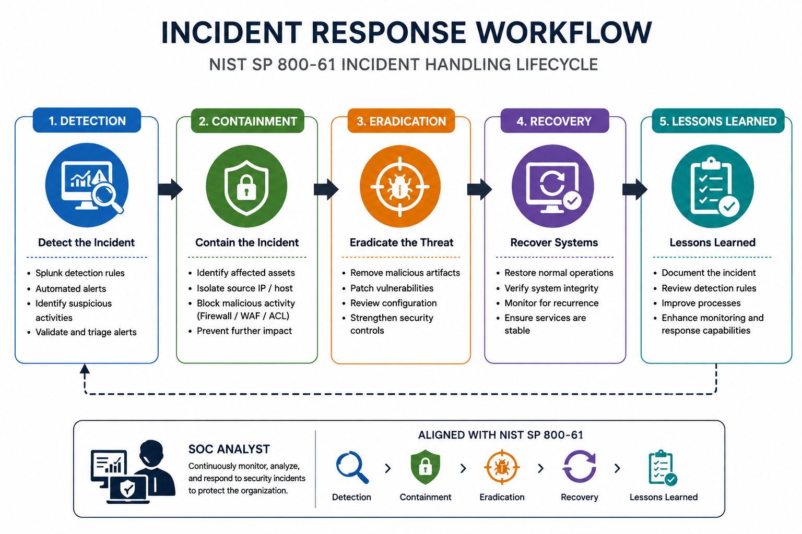

# Architecture

This folder contains architecture diagrams used in this project.

## 1. SOC Architecture

Illustrates the end-to-end SOC environment, including attack simulation, log collection, SIEM processing, dashboard monitoring, alert generation, and analyst investigation.

---

## 2. Incident Response Workflow

Illustrates the incident handling process based on the NIST SP 800-61 framework.

